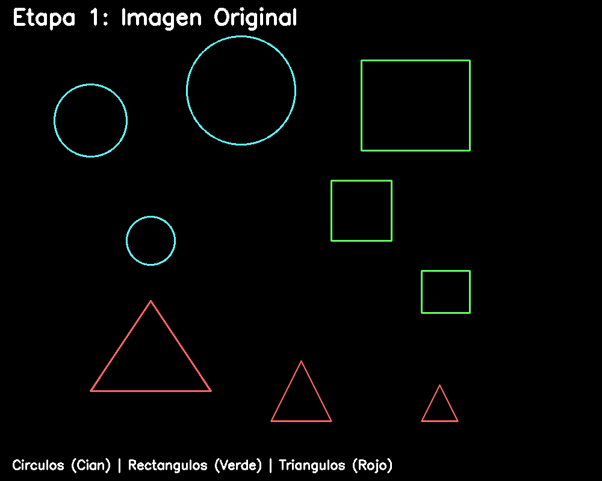

# Resumen 

### Ejercicio 6

En este ejercicio utilizamos OpenCV para analizar imágenes y extraer información geométrica de los objetos presentes. Primero, se lee la imagen y se convierte a una versión binarizada para facilitar la detección de contornos. Luego, se identifican los contornos de cada objeto y, a partir de ellos, se calculan métricas importantes como el área (cv2.contourArea), el perímetro (cv2.arcLength) y el centroide usando los momentos (cv2.moments). Finalmente, los resultados se dibujan directamente sobre la imagen original, mostrando de forma visual las métricas calculadas para cada objeto. Este proceso permite comprender y visualizar de manera clara las propiedades geométricas de los elementos en la imagen.

#### GIF

#### Código
[Analisis figuras geometricas](../2025_10_19_taller_cv_3d/ejercicios/06_analisis_figuras_geometricas/Practica%203.ipynb)

#### Comentarios personales

Este ejercicio me ayudó a comprender cómo los contornos representan objetos binarizados y cómo extraer información geométrica de ellos.
El mayor reto fue ajustar el umbral para que los contornos se detectaran correctamente.
En el futuro, me gustaría automatizar la clasificación de figuras (triángulo, cuadrado, círculo) usando approxPolyDP

#### Dependencias

#### Estructura del repositorio

#### Referencias

Documentación: OpenCV, matplotlib, numpy